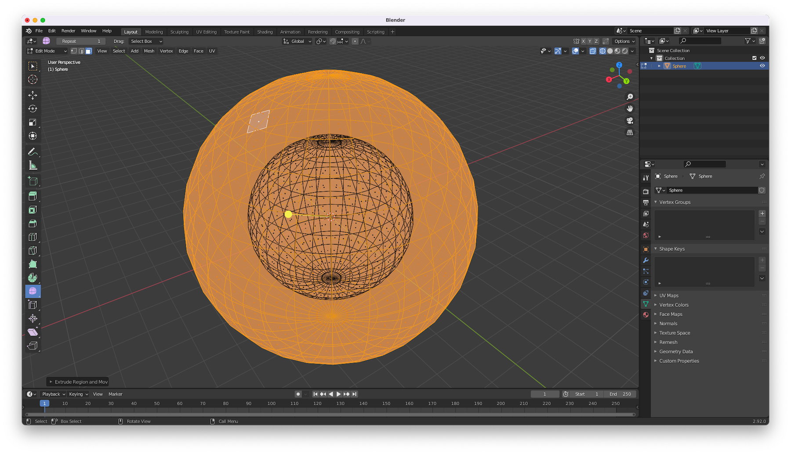
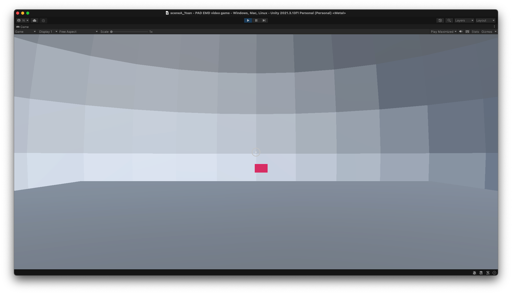
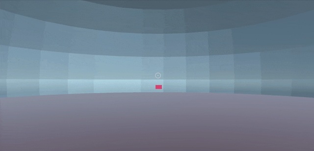
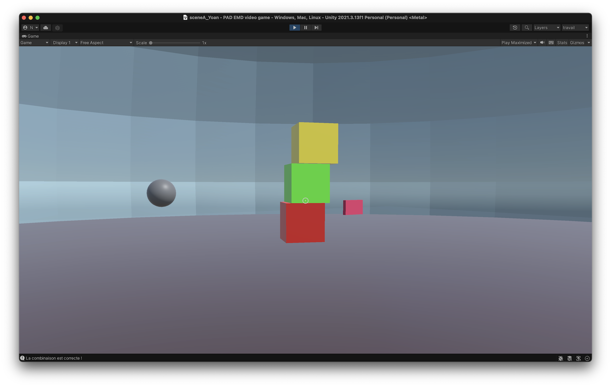
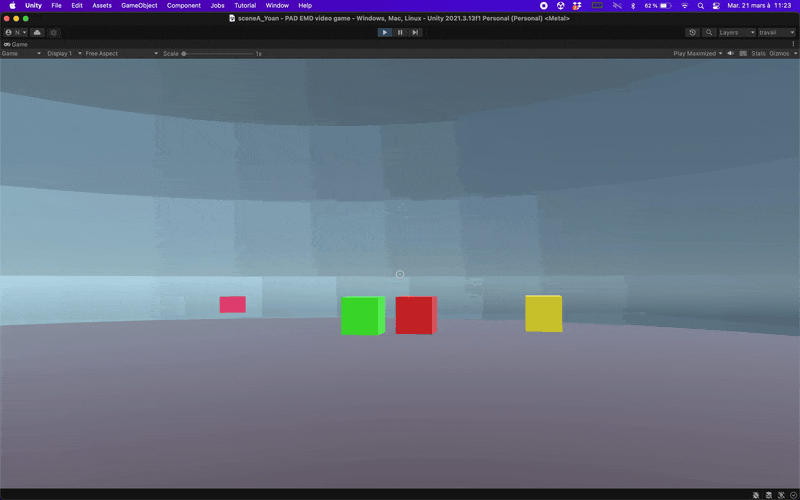
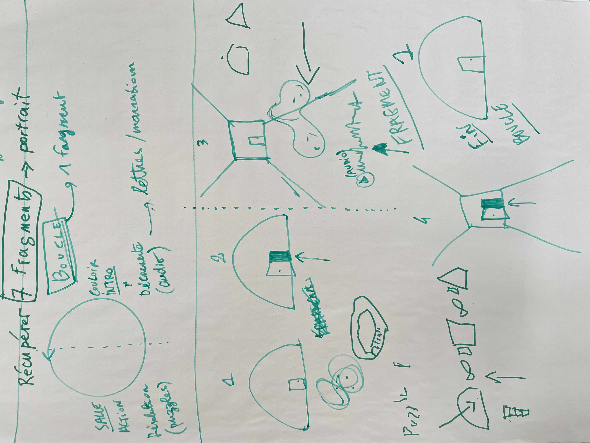
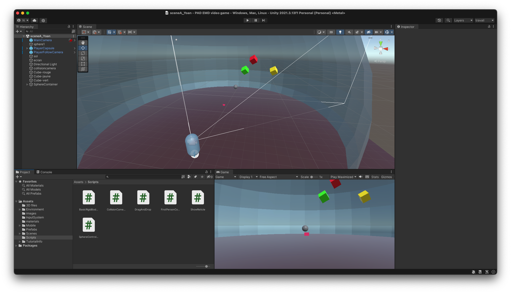
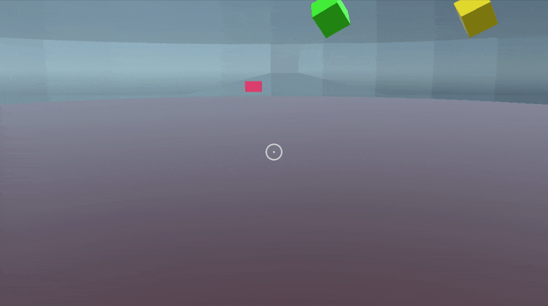
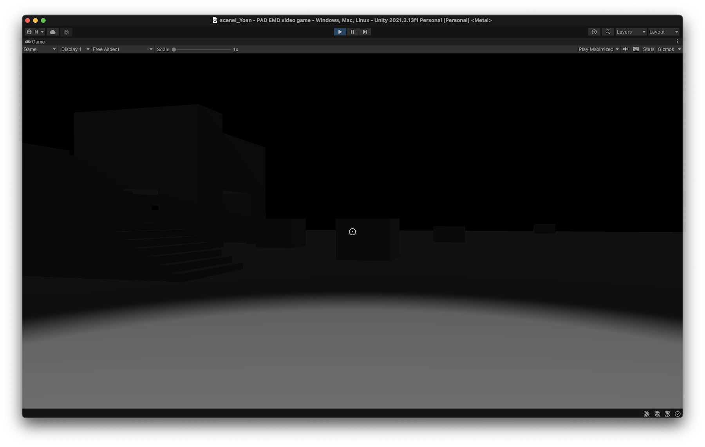

# pad-emd-game
Jeu vidéo réalisé dans le programme de recherche EMD de l'ÉSAD Orléans - janvier / juin 2023.

[Game Design Document](https://docs.google.com/document/d/1t_v4hHnD7XmxfCpN2FbWaEube1twnvBMK7OD0xdQHNY/edit?usp=sharing)

### work in progress - 16/03/23

Démarrage de la première scène (sphère). 
**Premier principe d'interaction** : cliquer sur l'écran pour aller vers l'interstice (cliquer dessus). La règle à suivre est de trouver le bon écran sur lequel cliquer.

### work in progress - 21/03/23

**Deuxième principe d'interaction** : déplacer des cubes avec la souris. La règle à suivre est de les empiler dans un ordre précis (rouge, vert, jaune). Si l'ordre est correct, une sphère apparaît.

### work in progress - 30/03/23
**Schéma de réalisation de la boucle de gameplay**

### work in progress - 6/04/23

Nouvelle salle plongée dans le noir...

