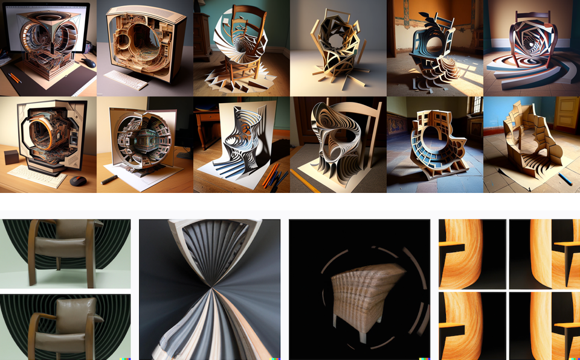

# PAD EMD séance du 9 mars 2023

# Configurer Unity + Git

1. Se faire un compte sur GitHub (gratuit) → [https://github.com/](https://github.com/)
2. Installer GitHub Desktop → [https://desktop.github.com/](https://desktop.github.com/)
3. Se connecter sur GitHub Desktop et cloner le projet → https://github.com/nicolastilly/pad-emd-game

Un tuto vidéo qui récap le process complet : [https://youtu.be/PJwXxtJDDZQ](https://youtu.be/PJwXxtJDDZQ)

# Pour démarrer dans le projet

- Créer une nouvelle scène vide avec le contrôle FPS et un plane terrain.

- Poser une image anamorphosée sur le sol. Détecter un angle de vue (empty) et faire apparaître l’objet à l’emplacement. Lorque l’on se déplace dans la zone spécifiée (empty), un script C# s’active.

    [https://youtu.be/48MxQYLmqbc](https://youtu.be/48MxQYLmqbc)

- S’inspirer de ce tuto qui explique comment masquer des objets dans un cube (inspiré du jeu Antichamber)

    [https://youtu.be/oCNhvy_qOp0](https://youtu.be/oCNhvy_qOp0)

- Modéliser des “objets de vision” aux travers desquel il est possible de regarder. Tube, trou, cercle, ouverture dans des objets 3D… Cela impose un point de vue au joueur.

# Compression des images / anamorphose avec les IAs / faire illusion

- [Anamorph Me!](https://www.anamorphosis.com/software.html)
- [Software AnaMorph-It](https://www.anamorphosen.ch/en/software/)
- [Monuments to guilt](https://louisthings.itch.io/monuments-to-guilt)
- Utiliser DALLE•2 ou Midjourney pour demander des images anamorphosées. Concept : continuer la recherche sur la materialité, la déformation et la compression des images conçues avec une IA. La déformation par anamorphose continu cet axe de recherche.

Prompt: *cylindrical anamorphic transformation of a chair*