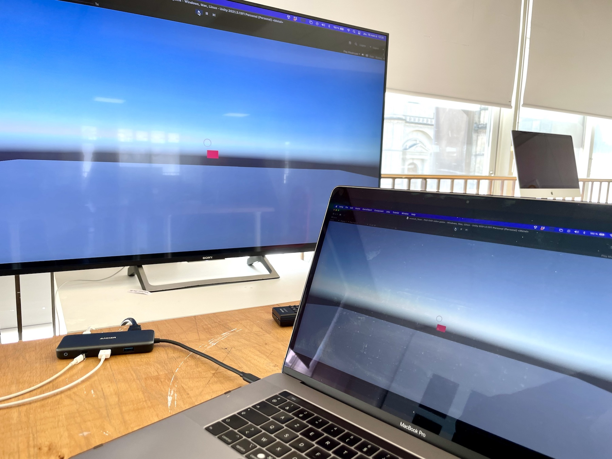

# PAD EMD séance du 16 mars 2023

# ChatGPT et les shader dans Unity

[https://www.youtube.com/watch?v=gPQpVgbBz58](https://www.youtube.com/watch?v=gPQpVgbBz58)

# Create a basic 3D game prototype like Doom using GPT-4.

[https://twitter.com/javilopen/status/1636085116400451584?s=12&t=lpLtaL7_U_4tmAL-T4HmOg](https://twitter.com/javilopen/status/1636085116400451584?s=12&t=lpLtaL7_U_4tmAL-T4HmOg)

# Programme proto Unity

- 1 scène Action ✔︎
- 1 scène espace Introspection ✔︎
- 1 caméra 3D avec 1 écran ✔︎
- C# cliquer sur la caméra pour changer de scène ✔︎
- Animer la transition avec un mouvementde caméra vers l'écran de la caméra 3D
- Halo en UI qui disparait dans la scène Introspection
- Ajouter un texte/audio dans la scène Introspection

